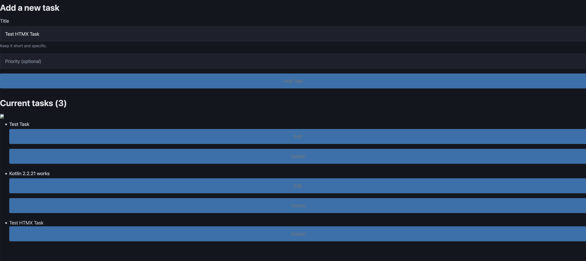
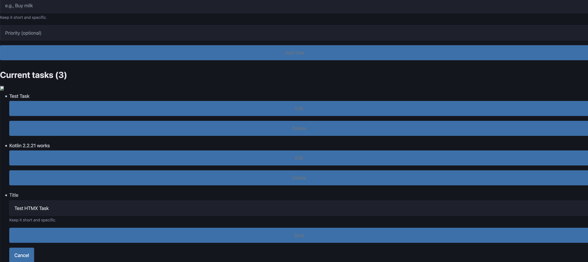
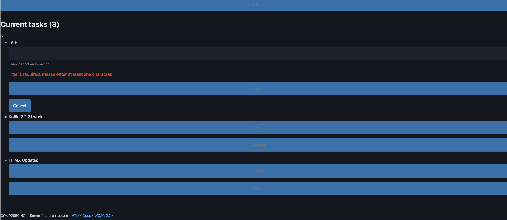
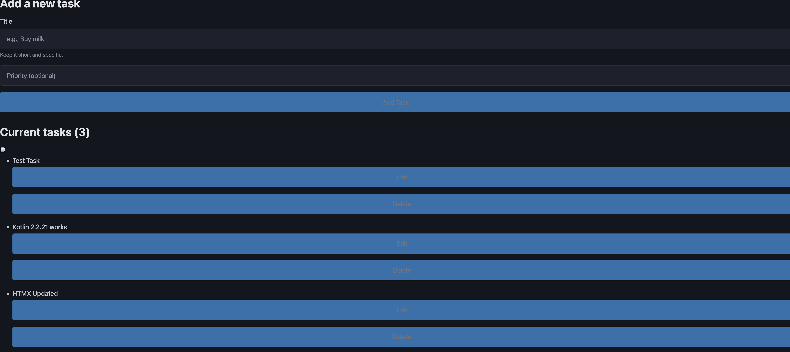
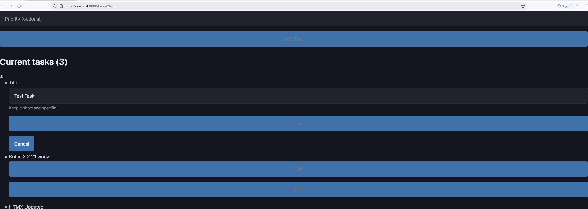

# Testing Notes — Week 7 Lab 1

## HTMX Path

**Date**: 2025/11/25  
**Browser**: Firefox (macOS)  
**JavaScript**: Enabled

### Test: Inline edit activation

- **Action**: Clicked "Edit" button on an existing task
- **Result**: ✅ Form appeared instantly in place (no full page reload)
- **Network**: GET `/tasks/1/edit` (AJAX, HTMX request confirmed in DevTools)
- **Screenshot**:  
    
  

### Test: Validation error

- **Action**: Deleted all text in the title field, clicked "Save"
- **Result**: ✅ Error shown under the field: "Title is required. Please enter at least one character."
- **ARIA**: `
` (or equivalent ID) confirmed in DevTools
- **Screenshot**:  
  

### Test: Successful save

- **Action**: Entered a valid new title, clicked "Save"
- **Result**: ✅ Swapped back to view mode, title updated; status region announced success
- **Screenshot**:  
  

---

## No-JS Path

**Date**: 2025/11/25  
**Browser**: Firefox (macOS)  
**JavaScript**: Disabled

### Test: Edit activation

- **Action**: Disabled JavaScript in Firefox, reloaded page, clicked "Edit" button
- **Result**: ✅ Full page reload, edit form shown for the selected task
- **URL**: `http://localhost:8080/tasks/2/edit`
- **Screenshot**:  
  

### Test: Validation error

- **Action**: Deleted title, clicked "Save"
- **Result**: ✅ Redirect to `/tasks/2/edit?error=blank`, error message shown next to the field
- **Screenshot**:  
  

---

## Keyboard Testing

**Date**: 2025/11/25  
**Input**: Keyboard only (no mouse)

### Test: Tab navigation

- **Path**: Tab → "Edit" → Enter → Title input (autofocus) → Tab → "Save" → Enter
- **Result**: ✅ Focus order logical, all buttons reachable
- **Focus indicators**: ✅ Visible outline on all interactive elements

---

## Screen Reader Testing

**Date**: 2025/11/25  
**Tool**: VoiceOver (macOS)

### Test: Edit button announcement

- **Navigated to**: "Edit" button using VoiceOver navigation keys
- **Announcement**: "Edit task: [Task Name], button"
- **Result**: ✅ Contextual label announced with task name

### Test: Input field announcement

- **Activated**: Edit button
- **Announcement**: "Title, edit, Keep it short and specific, [Task Name]"
- **Result**: ✅ Label + hint + current value announced together

### Test: Error announcement

- **Action**: Deleted title, pressed Save
- **Announcement**: "Title is required. Please enter at least one character, alert"
- **Result**: ✅ Error announced immediately (assertive, via `role="alert"`)

### Test: Status message announcement

- **Action**: Saved valid title
- **Announcement**: "Task '[New Title]' updated successfully"
- **Result**: ✅ Status announced via live region without moving focus

---

## Issues Found

- [x] None. All tests passed.
- [ ] List any issues here...

## WCAG Compliance Check

| Criterion                      | Status  | Evidence                                             |
| ------------------------------ | ------- | ---------------------------------------------------- |
| 2.1.1 Keyboard (A)             | ✅ Pass | All features accessible via Tab/Enter                |
| 3.3.1 Error Identification (A) | ✅ Pass | Error message explicit, aria-describedby links input |
| 4.1.3 Status Messages (AA)     | ✅ Pass | Live region announces success without focus change   |
