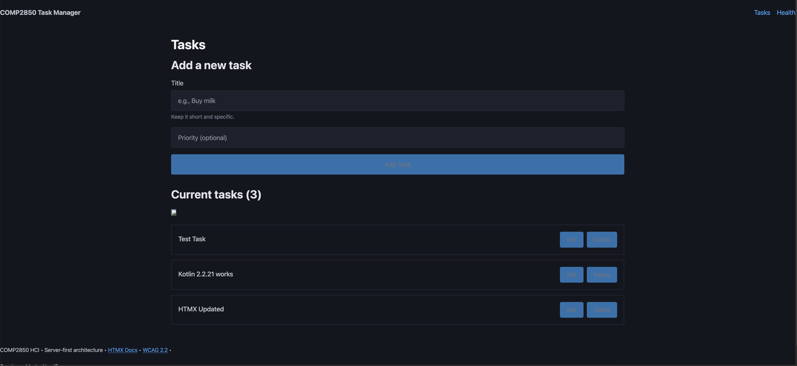
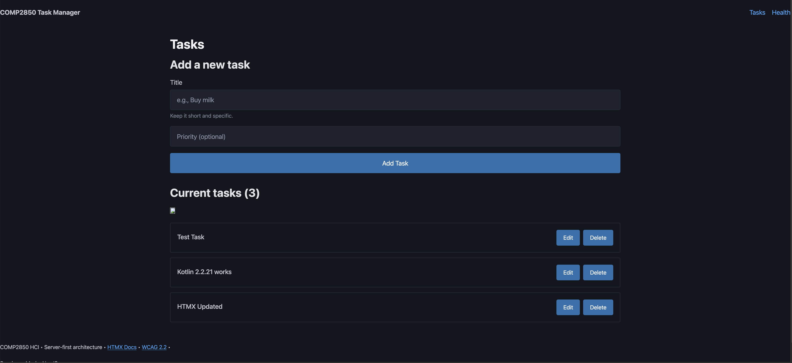

# Fix 09: Button Text Contrast (WCAG 1.4.3)

**Backlog ID(s)**: 4 (Button text contrast too low)  
**WCAG Criterion**: 1.4.3 Contrast (Minimum, Level AA)  
**Priority**: High

---

## Problem Statement

axe DevTools reported multiple `color-contrast` violations on the task manager buttons (see `wk07/audit/localhost_8080-COMP2850-Task-Manager-2025-11-30.json`):

- Affected elements (examples):
  - `form[action="/tasks"] > button` — “Add Task”
  - `button[aria-label="Edit task: …"]` — Edit buttons
  - `button[aria-label="Delete task: …"]` — Delete buttons
- Computed colours (before fix):
  - **Foreground**: `#6c757d`
  - **Background**: `#0172ad` (Pico primary button background)
  - **Contrast ratio**: **1.11:1** (fails AA 4.5:1 requirement for normal text)

This makes button labels hard or impossible to read for:

- People with **low vision** or **colour vision deficiencies**.
- Users in **bright sunlight** or on low‑quality displays.

---

## Target State

- All primary buttons (Add, Edit, Delete) must achieve:
  - **At least 4.5:1** contrast ratio (WCAG AA) for normal text.
  - Preferably closer to **7:1** to approach AAA where practical.

---

## Solution

Override the custom button text colour so that it contrasts strongly with the Pico primary background colour.

- **Before**:
  ```css
  button[type="submit"],
  button {
    color: #6c757d;
  }
  ```
- **After (chosen fix)**:
  ```css
  button[type="submit"],
  button {
    color: #ffffff;
  }
  ```

Rationale:

- Pico’s default primary button background is a saturated blue (`#0172ad`); white text generally achieves **AA or better** contrast against such backgrounds.
- This matches common design conventions (white text on primary buttons) and is easier to read for most users.

---

## Implementation

**File changed**: `src/main/resources/static/css/custom.css`

- Locate the “INTENTIONAL ACCESSIBILITY ISSUES” section at the bottom of the file.
- Replace the old button text rule with the new high‑contrast rule:

```css
/* Issue (fixed): Button color contrast failed WCAG 1.4.3 (AA)
   Previously: #6c757d text on Pico primary background (#0172ad) ≈ 1.11:1
   Fix: Use white text on primary background to meet contrast requirements */
button[type="submit"],
button {
  color: #ffffff;
}
```

---

## Verification Plan

1. **Visual inspection**

   - Reload `http://localhost:8080/tasks`.
   - Confirm “Add Task”, “Edit”, and “Delete” buttons now show **white text** on blue background.
   - Check readability at normal and 200% zoom.

2. **Contrast check (WebAIM Contrast Checker)**

   - Foreground: `#ffffff`
   - Background: use the computed primary background colour from DevTools (e.g., `#0172ad`).
   - Expected: contrast ratio ≥ 4.5:1 (Pass AA).

3. **axe DevTools re-scan**

   - Run axe again on `http://localhost:8080/tasks`.
   - Expected: `color-contrast` rule no longer appears as a failing rule.

4. **Regression testing**
   - Re‑test:
     - Add Task.
     - Inline Edit (HTMX path).
     - Inline Edit (No‑JS path).
     - Delete Task.
   - Confirm no behavioural regressions and that keyboard/focus behaviour is unchanged.

---

## Evidence

- **Before (failing contrast)**  
  

- **After (improved contrast)**  
  

- **axe DevTools after fix**  
  Results recorded in `wk07/audit/localhost_8080-2025-11-30.json`, which shows that `color-contrast` is no longer reported as a failed rule (only `image-alt` and `link-name` remain).
