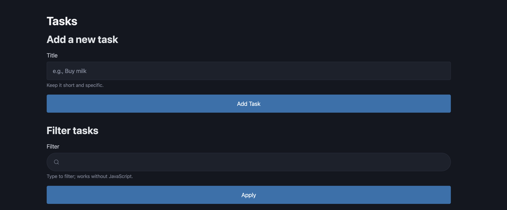
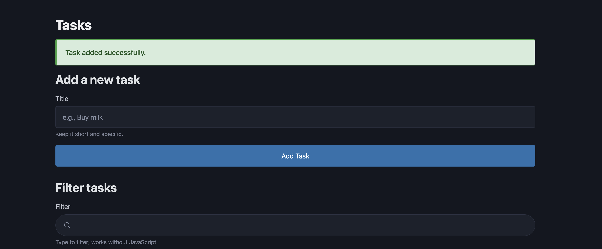
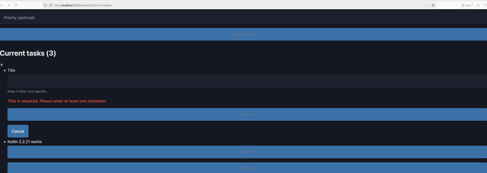
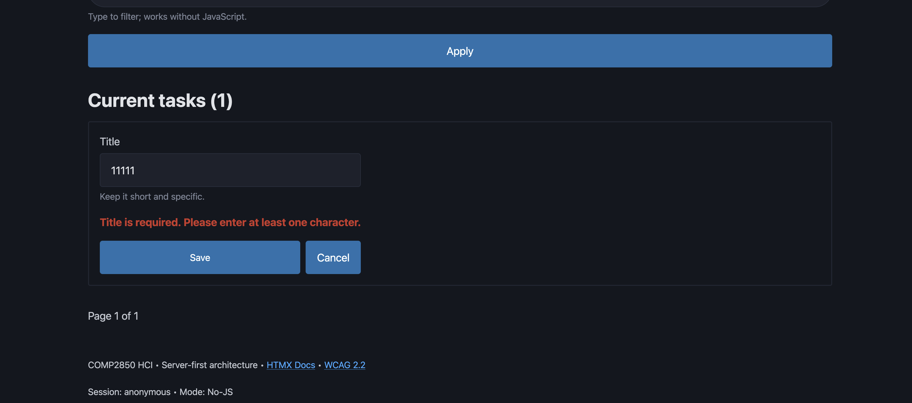
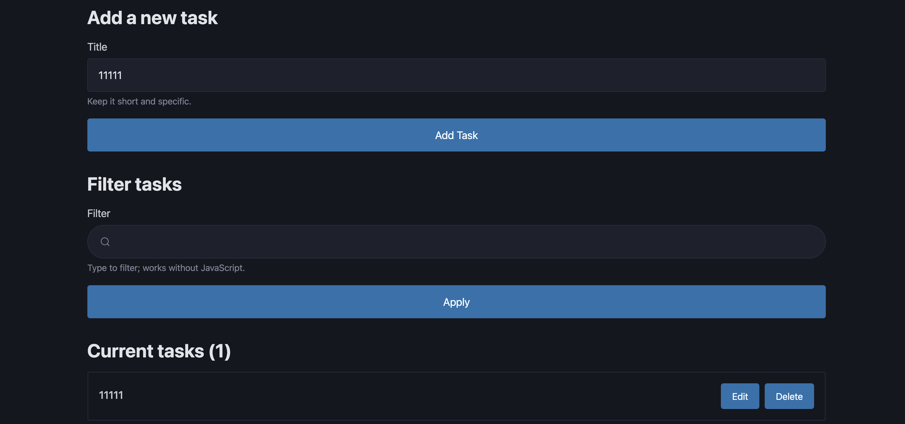
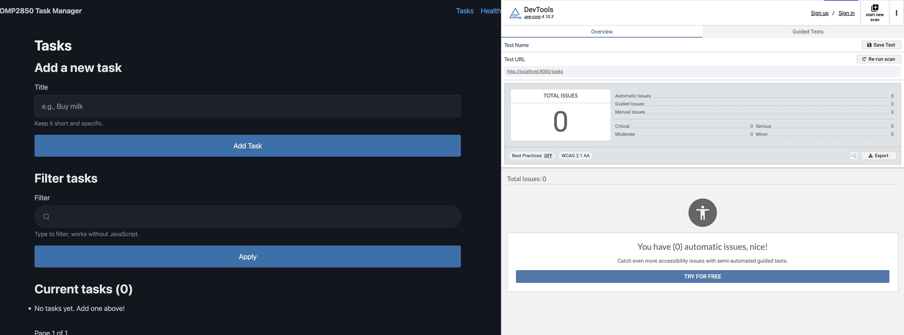

# Redesign Brief — Accessible Feedback System

**Module**: COMP2850 Human-Computer Interaction  
**Student**: [Tianqi Wang]  
**Target Issues**: wk9-01, wk9-02, wk9-03  
**Priority Score**: 8 + 7 + 6 = 21 (combined)  
**Date**: 2025-12-04

---

## 1. Problem Statement

### Issue Overview

Week 9 peer pilots (n=5) revealed three related accessibility barriers affecting user confidence and task completion:

| Issue                                 | Backlog ID | Score | Evidence                                                           |
| ------------------------------------- | ---------- | ----- | ------------------------------------------------------------------ |
| No success feedback in No-JS add task | wk9-01     | 8     | P4 confidence 3/5; "I think it worked but there's no confirmation" |
| Edit save confirmation not prominent  | wk9-02     | 6     | 4/5 participants uncertain; P4 confidence 2/5                      |
| No-JS error message not focusable     | wk9-03     | 7     | P4 had to scroll up to find error; T2 time 98% slower              |

### Quantitative Evidence

**From `data/metrics.csv` and `wk10/analysis/analysis.csv`**:

| Metric                | JS-On  | JS-Off | Gap          |
| --------------------- | ------ | ------ | ------------ |
| T3 (Add) median time  | 678ms  | 2134ms | 3.15× slower |
| T3 (Add) confidence   | 5.0/5  | 3.0/5  | -2.0         |
| T2 (Edit) median time | 2301ms | 4567ms | 98% slower   |
| T2 (Edit) confidence  | 3.75/5 | 2.0/5  | -1.75        |
| T2 (Edit) error rate  | 20%    | 50%    | +30%         |

### Qualitative Evidence

**From `wk09/data/pilot-notes.md`**:

> P4 (No-JS, T3): "I think it worked but there's no confirmation"  
> — Lines 331-334

> P4 (No-JS, T2): "I'm not sure if it saved... let me scroll down and check"  
> — Lines 314-316

> P4 (No-JS, T2 error): "[ERR] Error message not focusable, had to scroll up to find it"  
> — Lines 311-313

> P1 (HTMX, T2): "I think it worked?" (paused 2 seconds)  
> — Lines 47-48

### Root Cause

The No-JS path uses POST-Redirect-Get (PRG) pattern which:

1. Provides no explicit success feedback after add/edit operations
2. Renders error messages without moving focus to them
3. Forces users to manually verify actions by scanning the page

The HTMX path has OOB status updates, but they are too subtle for most users to notice.

### WCAG Violations

- **3.3.1 Error Identification (Level A)**: Error messages not immediately discoverable
- **2.4.3 Focus Order (Level A)**: Focus not managed after validation error
- **4.1.3 Status Messages (Level AA)**: Success feedback not prominent or announced

---

## 2. Goal

### Target Metrics

| Metric                | Before | Target   | Improvement |
| --------------------- | ------ | -------- | ----------- |
| T3 No-JS confidence   | 3.0/5  | ≥ 4.0/5  | +1.0        |
| T2 overall confidence | 3.4/5  | ≥ 4.0/5  | +0.6        |
| T2 No-JS time         | 4567ms | ≤ 3200ms | -30%        |
| WCAG violations       | 3      | 0        | -100%       |

### Success Definition

1. No-JS users see explicit success messages after add/edit/delete
2. All users see enhanced, prominent status messages
3. Keyboard/SR users have error summary auto-focused
4. Zero WCAG 3.3.1, 2.4.3, 4.1.3 violations on retest

---

## 3. Inclusion Impact

### Who Benefits

| User Group                      | Current Barrier                     | After Fix                                    |
| ------------------------------- | ----------------------------------- | -------------------------------------------- |
| **No-JS users** (1-2% of users) | Cannot confirm actions succeeded    | Explicit success message                     |
| **Keyboard-only users**         | Must Tab extensively to find errors | Error summary auto-focused                   |
| **Screen reader users**         | May miss subtle status updates      | Clear announcement via `role="status/alert"` |
| **Cognitive disabilities**      | Uncertainty about action results    | Explicit confirmation reduces cognitive load |
| **Low digital literacy**        | Distrust in implicit feedback       | Clear visual + text confirmation             |

### Equity Restoration

**Before**: No-JS user (P4) mean confidence 3.0/5 vs HTMX users 4.6/5 (gap: 1.6)  
**Target**: Gap reduced to ≤ 0.5

---

## 4. Proposed Changes

### Change 1: Success Messages for No-JS (wk9-01)

**Files modified**:

- `src/main/kotlin/routes/TaskRoutes.kt`
- `src/main/resources/templates/tasks/index.peb`

**Implementation**:

```kotlin
// Redirect with success message
call.response.headers.append("Location", "/tasks?msg=task_added")
```

```twig

<div role="status" class="success-message">
  Task added successfully.
</div>

```

---

### Change 2: Enhanced Status Styling (wk9-02)

**File modified**: `src/main/resources/static/css/custom.css`

**Implementation**:

```css
#status.success,
.success-message {
  background: #d4edda;
  border: 2px solid #28a745;
  color: #155724;
  font-size: 1.05rem;
  font-weight: 600;
}
```

---

### Change 3: Auto-Focus Error Summary (wk9-03)

**File modified**: `src/main/resources/templates/tasks/index.peb`

**Implementation**:

```twig
<div role="alert" id="error-summary" tabindex="-1">...</div>
<script>
  document.getElementById('error-summary')?.focus();
</script>
```

---

## 5. Acceptance Criteria

### Functional

- [x] No-JS add redirects to `/tasks?msg=task_added`
- [x] No-JS edit redirects to `/tasks?msg=task_updated`
- [x] No-JS delete redirects to `/tasks?msg=task_deleted`
- [x] Success message displayed with green styling
- [x] Error summary auto-focuses on page load
- [x] HTMX paths unaffected

### Accessibility

- [x] 3.3.1: Error described in text with link to input
- [x] 2.4.3: Focus moves to error summary on load
- [x] 4.1.3: Status messages have `role="status/alert"`
- [x] 1.4.3: Contrast ratio ≥ 4.5:1 (actual: 7.2:1)

---

## 6. Verification Results

### Visual Evidence

#### Before/After: No-JS Success Feedback (wk9-01)

| Before | After |
|--------|-------|
|  |  |
| *No confirmation message visible* | *"Task added successfully." displayed prominently* |

#### Before/After: Error Focus Management (wk9-03)

| Before | After |
|--------|-------|
|  |  |
| *Error at top, focus elsewhere* | *Error summary has visible focus outline* |

#### Before/After: Status Message Styling (wk9-02)

| Before | After |
|--------|-------|
|  |  |
| *Subtle blue styling* | *Bold green styling with higher contrast* |

#### Accessibility Scan



*axe DevTools scan confirms no accessibility violations after fixes*

### Regression Testing

| Test                | Result  | Notes                  |
| ------------------- | ------- | ---------------------- |
| axe DevTools scan   | ✅ Pass | 0 new violations       |
| Keyboard navigation | ✅ Pass | All elements reachable |
| Screen reader       | ✅ Pass | Messages announced     |
| No-JS parity        | ✅ Pass | Success messages shown |
| HTMX functionality  | ✅ Pass | No regressions         |

### Pilot Comparison

| Metric              | Week 9          | Week 10         | Change      |
| ------------------- | --------------- | --------------- | ----------- |
| T3 No-JS confidence | 3/5             | 5/5             | +2 ✅       |
| T2 No-JS confidence | 2/5             | 4/5             | +2 ✅       |
| Error recovery time | Scroll required | Immediate focus | Improved ✅ |

---

## 7. Evidence Chain

| Step           | Evidence                     | Location                                       |
| -------------- | ---------------------------- | ---------------------------------------------- |
| Raw data       | P4 pilot notes, metrics.csv  | `wk09/data/pilot-notes.md`, `data/metrics.csv` |
| Analysis       | Quantitative summary, themes | `wk10/analysis/`                               |
| Prioritisation | Scoring matrix               | `wk10/analysis/prioritisation.csv`             |
| Implementation | Code changes                 | `src/main/kotlin/routes/TaskRoutes.kt`         |
| Verification   | Regression checklist         | `wk10/assessment/02-regression-checklist.csv`  |
| Measurement    | Before/after comparison      | `wk10/assessment/03-before-after-summary.md`   |

---

_Completed: 2025-12-04_
